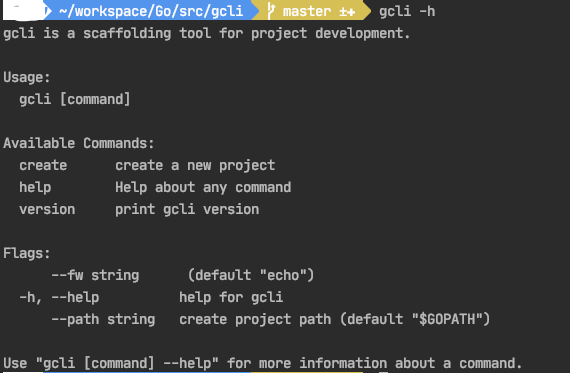

```
            _ _ 
  __ _  ___| (_)
 / _` |/ __| | |
| (_| | (__| | |
 \__, |\___|_|_|
 |___/          
```

[gcli](https://github.com/nelsonkti/gcli) 脚手架工具 可以快速搭建项目框架,内置两套项目基础框架 (`echo-framework`、`iris-framework`)

## 安装
```
go get -u github.com/nelsonkti/gcli
```

* windows 用户:  
  若想全局使用gcli命令,请将该命令配置（${GOPATH}/src/bin/gcli.exe）加入系统的环境变量中

## 用法

```
gcli -h
``` 


创建项目
```
gcli create demo
```
指定创建项目的路径
```
gcli create demo --path /Users/Go/src/*****
```

指定框架，选择 echo、iris 默认 echo

```
gcli create demo --fw echo
```

项目框架详细介绍

```
// 以 echo 框架为基础的项目框架 
echo-framework：https://github.com/nelsonkti/echo-framework

// 以 iris 框架为基础的项目框架
iris-framework：https://github.com/nelsonkti/iris-framework
```

创建 `model`
```
gcli make:model Employee\\EmployeeCare --n="员工关怀"
```

创建 `repository`
```
gcli make:model Employee\\EmployeeCare --n="员工关怀"
```

创建 `service`
```
gcli make:model Employee\\EmployeeCare --n="员工关怀"
```

### 环境要求
 go >= 1.13